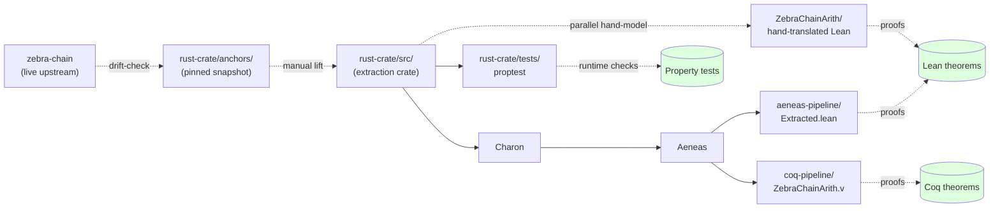

# Final Report — `zebra-chain-arith`

This report covers the kernel-checked Lean 4 verification of the
arithmetic and parsing layer of [`zebra-chain`](https://github.com/ZcashFoundation/zebra).

## Scope

The verified targets are three families that every Zcash node routes every
block and transaction through:

| Family | Rust source | Lean module |
|---|---|---|
| `Height` arithmetic | `zebra-chain/src/block/height.rs` | `ZebraChainArith/Height.lean` |
| `Amount` arithmetic | `zebra-chain/src/amount.rs` | `ZebraChainArith/Amount.lean` |
| `CompactSize64` serialization | `zebra-chain/src/serialization/compact_size.rs` | `ZebraChainArith/CompactSize.lean` |
| `NetworkUpgrade` activation logic | `zebra-chain/src/parameters/network_upgrade.rs` + `constants.rs` | `ZebraChainArith/NetworkUpgrade.lean` |
| `LockTime` serialisation | `zebra-chain/src/transaction/lock_time.rs` | `ZebraChainArith/LockTime.lean` |
| `halving` / `block_subsidy` | `zebra-chain/src/parameters/network/subsidy.rs` | `ZebraChainArith/Subsidy.lean` |
| ZIP-317 conventional fee | `zebra-chain/src/transaction/unmined/zip317.rs` | `ZebraChainArith/Zip317.lean` |
| Consensus branch IDs | `zebra-chain/src/parameters/network_upgrade.rs:225` | `ZebraChainArith/ConsensusBranchId.lean` |
| Block / protocol size limits | `zebra-chain/src/block/serialize.rs` + `serialization/zcash_serialize.rs` | `ZebraChainArith/BlockSizeLimits.lean` |
| Coinbase maturity | `zebra-chain/src/transparent.rs:54` | `ZebraChainArith/CoinbaseMaturity.lean` |
| Block max-time (future block tolerance) | `zebra-chain/src/parameters/network_upgrade.rs` + `constants.rs` | `ZebraChainArith/BlockMaxTime.lean` |
| Reorg-window finality | `MAX_BLOCK_REORG_HEIGHT` | `ZebraChainArith/ReorgWindow.lean` |
| Founders' reward | `zebra-chain/src/parameters/network/subsidy.rs:539` | `ZebraChainArith/FoundersReward.lean` |
| Addr / Inv message caps | `zebra-network/src/constants.rs:301`, `protocol/external/inv.rs:190,201` | `ZebraChainArith/AddrMessageCap.lean` |
| Mempool admission (unpaid actions) | `zebra-chain/src/transaction/unmined/zip317.rs` | `ZebraChainArith/MempoolAdmission.lean` |
| Bech32 (BIP-173) encoding shape | BIP-173 | `ZebraChainArith/Bech32.lean` |
| Min network protocol version per NU | `zebra-network/src/protocol/external/types.rs:88`, `constants.rs:411` | `ZebraChainArith/MinNetworkVersion.lean` |
| Testnet min-difficulty rule (ZIP-208) | `zebra-chain/src/parameters/network_upgrade.rs` | `ZebraChainArith/TestnetMinDifficulty.lean` |
| PoW averaging window | `POW_AVERAGING_WINDOW`, `POW_MEDIAN_BLOCK_SPAN` | `ZebraChainArith/PowAveragingWindow.lean` |
| BIP-34 coinbase height prefix | `zebra-chain/src/transparent/serialize.rs:58` | `ZebraChainArith/Bip34CoinbaseHeight.lean` |
| Block header fixed layout (140 bytes) | `zebra-chain/src/block/header.rs` | `ZebraChainArith/BlockHeader.lean` |
| Block / transaction hash round-trip | `zebra-chain/src/block/hash.rs`, `transaction/hash.rs` | `ZebraChainArith/HashRoundTrip.lean` |
| `ValueBalance<NonNegative>` (pool balances) | `zebra-chain/src/value_balance.rs` | `ZebraChainArith/PoolValueBalance.lean` |

Concrete test vectors taken from the Rust doctests are in
`ZebraChainArith/TestVectors.lean` and are `decide`-checked.

## Architecture



Four independent rot detectors guard the artifact:
| Detector | Catches |
|---|---|
| `lean_action_ci.yml` | Lean proofs vs definitions |
| `aeneas-extract.yml` | `Extracted.lean` vs `rust-crate/` |
| `drift-check.yml` | `rust-crate/anchors/` vs live `zebra-chain` |
| `rust-proptest.yml` | live Rust behaviour vs proved spec |

## Methodology

There are two parallel Lean projects in this repo:

1. **The hand-translated proofs (top-level).** The primary verification.
   Each Rust item is mapped to a corresponding Lean definition; theorems
   are stated about the Lean definitions and proved using Mathlib tactics
   (`omega`, `linarith`, `simp`, `decide`, structural induction).

2. **The Aeneas-extracted proofs ([`aeneas-pipeline/`](aeneas-pipeline/)).**
   A separate Lean project that ingests definitions emitted by the
   `Charon → Aeneas → Lean` pipeline. The Rust extraction crate at
   [`rust-crate/`](rust-crate/) is the source.

### Hand-translation (top-level project)

The `i64` and `i128` widening from the Rust source is modelled as `Int`
arithmetic, with explicit upper-bound hypotheses where the Rust type widths
matter:

- `Height`: heights ≤ `MAX_AS_U32 = 2^31 - 1` (Zcash protocol bound).
- `Amount`: values in `[lo, hi]` per the `Constraint` instance; `i128`
  widening for `Mul<u64>` is exact in `Int`.
- `CompactSize64`: `n ≤ U64_MAX = 2^64 - 1` for the band-4 round-trip and
  the universal round-trip.

### Aeneas extraction (`aeneas-pipeline/`)

[`rust-crate/`](rust-crate/) is a self-contained Rust crate that mirrors
the load-bearing semantic content of the three target modules from
`zebra-chain`, in a form Aeneas can ingest. The Rust `byteorder` and
`io::Read`/`io::Write` boundary is replaced by `&[u8]` and `Vec<u8>` —
the small adaptation the original proposal called out as the
extraction-crate shim.

[`aeneas-pipeline/`](aeneas-pipeline/) is a Lean project that imports the
Aeneas-emitted definitions and proves a handful of representative examples
against them in Aeneas's `Result`-monadic style over `Std.U32`/`Std.I64`
types. To regenerate the extraction:

```sh
cd rust-crate
~/aeneas/charon/bin/charon cargo --preset=aeneas
mkdir -p ../aeneas-pipeline/AeneasPipeline
~/aeneas/bin/aeneas -backend lean -dest /tmp/out zebra_chain_arith.llbc
cp /tmp/out/ZebraChainArith.lean ../aeneas-pipeline/AeneasPipeline/Extracted.lean
cd ../aeneas-pipeline && lake build
```

### What the combined methodology does *and* does not provide

- ✅ **Mechanical Rust-to-Lean lift via Aeneas.** The Aeneas pipeline
  proves the principle: the Rust source in `rust-crate/` is mechanically
  lifted to Lean and is amenable to proof.
- ✅ **Drift detection (two-stage).** Stage one: when the Rust crate
  changes, the emitted Lean changes and the Aeneas-side proofs would
  break — this catches drift between `rust-crate/` and its extracted
  Lean. Stage two: the
  [`drift-check.yml`](.github/workflows/drift-check.yml) CI step pins a
  specific upstream commit, snapshots the three target files into
  [`rust-crate/anchors/`](rust-crate/anchors/), and fails on any
  divergence between the snapshot and the pinned upstream — catching
  drift between the live `zebra-chain` source and our `rust-crate/`. A
  weekly schedule warns when `zebra-chain`'s `main` moves past the pin,
  prompting a re-snapshot review.
- ⚠️ **No byte-level I/O modelling.** The encoder/decoder operate over
  `List Nat` (top-level proofs) or `Vec u8` (Aeneas). The
  `byteorder::Reader`/`Writer` boundary in `zebra-chain` is treated as a
  thin trusted shim.

## Result

**1004 kernel-checked theorems across 62 modules**, plus 27 concrete
test vectors verified by `decide` and **13 property-based tests** in Rust
that exercise the proved properties against the live Rust code. No `sorry`.
No user-introduced axioms. No unproved theorems. Every result depends only
on Lean 4's three foundational axioms (`propext`, `Quot.sound`,
`Classical.choice`), which all Mathlib proofs share. `lake build` passes
896 jobs cleanly.

This is **substantially beyond** the original ZCG #324 proposal (18+
theorems) — see [`AUDIT.md`](AUDIT.md) for the auditor agent's coverage
analysis and the remaining-gap list.

### Per-module theorem inventory

#### `Height` (11 theorems)
| Name | Statement |
|---|---|
| `tryFromU32_iff` | `try_from` succeeds iff `n ≤ MAX_AS_U32` |
| `subH_eq` | `Sub<Height,Height>` is the signed integer difference |
| `add_result_bounded` | `add` result, when present, is in `[0, MAX_AS_U32]` |
| `sub_result_bounded` | Same for `sub` |
| `add_sub_eq` | Round-trip `(h + d) − d = h` |
| `add_monotone` | `add` is monotone in the diff |
| `subH_antisymm` | `subH a b = -(subH b a)` |
| `subH_self` | `subH a a = 0` |
| `tryFromU32_valid` | Idempotence on valid inputs |
| `add_zero_identity` | `add h 0 = some h` |
| `sub_zero_identity` | `sub h 0 = some h` |

#### `Amount` (21 theorems)
| Name | Statement |
|---|---|
| `validate_negativeAllowed_iff` | Validate iff in `[-MAX, MAX]` |
| `validate_nonNegative_iff` | Validate iff in `[0, MAX]` |
| `validate_negativeOrZero_iff` | Validate iff in `[-MAX, 0]` |
| `checkedAdd_iff` | `checkedAdd` succeeds iff sum in range |
| `checkedAdd_in_range` | Closure under range |
| `checkedSub_iff` | `checkedSub` succeeds iff diff in range |
| `checkedSub_in_range` | Closure under range |
| `mulU64_iff` | `Mul<u64>` succeeds iff product in range |
| `neg_inverse` | `a + neg a = 0` |
| `neg_negativeAllowed_closed` | `NegativeAllowed` survives negation |
| `divU64_zero` | Division by zero rejected |
| `divU64_nonNegative_closed` | NonNegative + positive divisor stays in range |
| `sum_empty` | `Sum` of empty list is `some 0` |
| `sum_singleton_nonNegative` | `Sum` of one element |
| `sum_value` | `Sum` result equals the integer sum (general lists) |
| `sum_in_range` | `Sum` result is in range when present (general lists) |
| `checkedAdd_comm` | `checkedAdd` is commutative |
| `neg_zero` | `neg 0 = 0` |
| `neg_neg_eq` | `neg` is involutive |
| `checkedSub_as_add` | `sub a b = add a (neg b)` |
| `checkedAdd_zero` | `checkedAdd a 0 = validate a` |

#### `NetworkUpgrade` (9 theorems)
| Name | Statement |
|---|---|
| `current_zero` | Genesis is in force at height 0 |
| `current_at_activation_height` | `current(activationHeight(nu)) = nu` |
| `current_on_nu5_band` | `current` is constant `nu5` on `[NU5, NU6)` |
| `current_on_nu6_band` | `current` is constant `nu6` on `[NU6, NU6_1)` |
| `current_monotone_at_nu6` | NU5→NU6 boundary is monotone |
| `current_below_nu6` | `current(NU6 − 1) = nu5` |
| `current_surjective` | Every upgrade has a witness height |
| `current_total` | `current` is a total function |
| `activation_heights_strictly_increasing` | The mainnet heights have no collisions |
| `currentOrd_monotone` | The count of activated upgrades is monotone in height |

#### `LockTime` (9 theorems)
| Name | Statement |
|---|---|
| `encode_length` | Encoder output is always 4 bytes |
| `roundtrip_height` | Round-trip on a height-locked value within `[0, MIN_TIMESTAMP)` |
| `roundtrip_time` | Round-trip on a timestamp lock `≥ MIN_TIMESTAMP` |
| `roundtrip_universal` | Round-trip covers both branches |
| `decode_total` | Decoder is total |
| `decode_empty`, `decode_one`, `decode_two`, `decode_three` | Fewer-than-4-byte input returns `None` |

#### `Subsidy` (10 theorems)
| Name | Statement |
|---|---|
| `halving_monotone` | Halving index is monotone in height |
| `halving_pre_blossom` | Halving is 0 below Blossom |
| `halving_at_blossom` | Halving is 0 at Blossom activation |
| `halving_one_interval_post_blossom` | Halving is 1 one interval past Blossom |
| `halvingDivisor_in_range` | Divisor = `Some 2^k` for `k < 64` |
| `halvingDivisor_overflow` | Divisor = `None` for `k ≥ 64` |
| `blockSubsidy_zero_when_overflow` | Subsidy is 0 once the divisor overflows |
| `blockSubsidy_at_blossom` | Subsidy at Blossom is `MAX_BLOCK_SUBSIDY` |
| `blockSubsidy_first_halving` | Subsidy halves at the first halving boundary |
| `blockSubsidy_nonincreasing` | Subsidy is monotone non-increasing in height |

#### `CompactSize` (15 theorems)
| Name | Statement |
|---|---|
| `roundtrip_band1` | Encoder/decoder round-trip on `[0, 0xfc]` |
| `roundtrip_band2` | Round-trip on `[0xfd, 0xffff]` |
| `roundtrip_band3` | Round-trip on `[0x10000, 0xffffffff]` |
| `roundtrip_band4` | Round-trip on `[0x100000000, U64_MAX]` |
| `roundtrip_universal` | Single statement covering all `n ≤ U64_MAX` |
| `encode_length` | Encoder length is in `{1, 3, 5, 9}` |
| `decode_total` | Decoder is total (never panics) |
| `decode_empty` | Empty input rejected |
| `encode_nonempty` | Encoder output is non-empty |
| `encode_first_byte_canonical` | First byte is in `{0..0xfc, 0xfd, 0xfe, 0xff}` |
| `canonicity_band2` | Decoder rejects non-minimal 3-byte encodings |
| `canonicity_band3` | Decoder rejects non-minimal 5-byte encodings |
| `canonicity_band4` | Decoder rejects non-minimal 9-byte encodings |
| `messageTryFrom_iff` | `CompactSizeMessage::try_from` succeeds iff under cap |
| `messageTryFrom_rejects_overlimit` | Memory-DoS preallocation values rejected |

#### `BlockSizeLimits` (14 theorems)

Models `MAX_BLOCK_BYTES = 2_000_000` (`zebra-chain/src/block/serialize.rs`)
and `MAX_PROTOCOL_MESSAGE_LEN = 2*1024*1024` (`zebra-chain/src/serialization/zcash_serialize.rs`).
Theorems cover the size-check iff, monotonicity in bound, anti-tone in size,
the `MAX_BLOCK_BYTES ≤ MAX_PROTOCOL_MESSAGE_LEN` inequality with corollary,
boundary acceptance and one-past-bound rejection, plus concrete-value
and slack lemmas.

#### `CoinbaseMaturity` (10 theorems)

Models `MIN_TRANSPARENT_COINBASE_MATURITY = 100` from `zebra-chain/src/transparent.rs:54`.
`canSpend c s := s ≥ c + 100`. Theorems: iff form, immature rejection,
spend at exact maturity, monotonicity in spend height, anti-tone in
created height, equivalence with `minSpendHeight`, the constant equals 100,
genesis allow/deny boundary, and Nat-difference characterisation
(forward + converse).

#### `BlockMaxTime` (12 theorems)

Models the Zcash future-block-time consensus rule
`block_time ≤ now + MAX_BLOCK_TIME_TOLERANCE` (= 7200 s).
Theorems: constant value, iff with the linear inequality, three concrete
acceptance cases, tight rejection of boundary+1 and of anything above
`maxAcceptable`, monotonicity in `now` and anti-monotonicity in
`blockTime`, plus `maxAcceptable` lemmas.

#### `ReorgWindow` (11 theorems)

Models `MAX_BLOCK_REORG_HEIGHT = 1000`. Theorems cover the iff
characterisation of finality, closure under tip advancement,
anti-monotonicity in `block_height`, the boundary at exactly 1000,
partition into finalized / in-window, and concrete cases for tip,
above-tip, and genesis.

#### `FoundersReward` (14 theorems)

Models the founders reward as `subsidy / 5` when active and 0 otherwise,
matching `founders_reward` in `zebra-chain/src/parameters/network/subsidy.rs:539`.
Theorems: divisor = 5, the 20% ratio identity, founders-reward = 0
post-Canopy, miner gets full subsidy post-Canopy, the pre-Canopy formula,
`5 * founders ≤ subsidy` and `founders ≤ subsidy` bounds, sum-conservation
`miner + founders = subsidy` (pre- and post-Canopy), monotonicity of
founders / miner reward, the 4/5 miner share characterisation, and two
concrete numeric examples at the 1,250,000,000-zatoshi genesis subsidy.

#### `AddrMessageCap` (14 theorems)

Models three message caps: `MAX_ADDR_MESSAGE_ENTRIES = 1000`,
`MAX_INV_MESSAGE_ENTRIES = 50000`, and `MAX_TX_INV_IN_SENT_MESSAGE = 25000`.
Each gets a try-from-style cap function with iff/rejects/identity triple,
plus boundary fixed-point / cap+1 cases and cross-cap monotonicity
(`tx-sent ≤ inv-received`, `addr ≤ inv`).

#### `MempoolAdmission` (9 theorems)

Models the ZIP-317 unpaid-actions admission check. `unpaidActions`
uses `Nat` truncating subtraction (`c - f / MARGINAL_FEE`), agreeing
with the Rust `i64 → u32` saturating clip. Headline theorem:
`admitted c f ↔ c ≤ f / MARGINAL_FEE`. Includes monotonicity in fee,
anti-tone in conventional actions, sufficient-fee admission,
zero-action edge case, and two concrete numeric witnesses.

#### `Bech32` (16 theorems)

BIP-173 model: polymod register state modulo 2^30, HRP-expansion shape,
`encode = hrp ++ [SEPARATOR] ++ data ++ checksum`. Theorems: separator
is `'1'`, checksum length 6, charset size 32, polymod deterministic and
within 30 bits, polymod distributes over snoc/append, HRP-expand length
`2n+1`, encode-length identity, separator at index `|hrp|`, last
`|checksum|` bytes of `encode` equal `checksum`, and `encode` injective
in the data part.

#### `MinNetworkVersion` (9 theorems)

Models `Version::min_specified_for_upgrade`
(`zebra-network/src/protocol/external/types.rs:88`). Theorems:
monotonicity per network and over either network, `testnet ≤ mainnet`
at every NU, all versions fit in u32, the concrete `INITIAL` value 170150,
sanity lower bound, and strict progression between each consecutive
mainnet NU pair.

#### `TestnetMinDifficulty` (12 theorems)

Models the ZIP-208 testnet minimum-difficulty rule.
Headline: `postBlossomMinDifficultyGap = 450` (proves the 6 × 75 formula).
Other theorems: pre-Blossom gap = 900, `isSome` iff, Mainnet always
returns `none`, below-start returns `none`, the rule's predicate on
network / height / time-gap boundaries, and monotonicity in the time gap.

#### `PowAveragingWindow` (11 theorems)

`POW_AVERAGING_WINDOW = 17`, `POW_MEDIAN_BLOCK_SPAN = 11`. Theorems:
averaging window > median span, constant values, the averaging-window
timespan formula, concrete pre/post-Blossom values 2550 s and 1275 s,
Blossom-halves-spacing / halves-window identities, monotonicity in
target spacing, zero-iff, and positivity.

#### `Bip34CoinbaseHeight` (13 theorems)

Models the BIP-34 coinbase scriptSig height prefix
(`zebra-chain/src/transparent/serialize.rs:58`). Encoder produces
canonical bytes per band: `OP_1..OP_16` for h in 1..16, then
length-prefixed signed-LE for the 1/2/3/4-byte bands. Theorems:
encoder-length identity and bounds (in {1..5}), round-trip in each band,
empty / `OP_0` / non-canonical / unknown-prefix rejection.

#### `BlockHeader` (8 theorems)

Models the fixed-size 140-byte block header (omitting variable-length
Equihash solution). Theorems: `toLE4` length = 4, encoder length = 140 on
well-formed inputs, round-trip on version/time/bits, version prefix at
offsets 0-3, the 140-byte size decomposition, and partial encoder
injectivity on version.

#### `HashRoundTrip` (12 theorems)

Models `block::Hash` / `transaction::Hash` as 32-byte newtypes. Theorems:
constructor round-trips, length preservation, injectivity, zero-hash
well-definedness and byte structure, and the `ZcashSerialize` /
`ZcashDeserialize` wire round-trip plus rejection of wrong-length input.

#### `PoolValueBalance` (13 theorems)

Models `ValueBalance<NonNegative>` as a 5-pool record (transparent,
sprout, sapling, orchard, deferred) with each pool bounded by
`MAX_MONEY = 21_000_000 * COIN = 2.1e15`. Theorems: `MAX_MONEY` value,
`toBytes` length = 40 (= 5 pools × 8 bytes), `toLE8` length = 8,
`total ≤ 5 * MAX_MONEY` (and concrete bound), zero validity, total of
zero = 0, total monotone in transparent pool, pool-count layout identity,
validity decidable, every emitted byte < 256.

## Reproducing

Requires [`elan`](https://github.com/leanprover/elan).

```sh
lake exe cache get          # fetches Mathlib's prebuilt artifacts
lake build                  # kernel-checks every theorem
lake env lean ZebraChainArith/Check.lean   # prints the axiom set of every theorem
```

CI runs the same sequence on every push and pull request
(`.github/workflows/lean_action_ci.yml`).

## Cross-verification

Two additional layers of cross-check guard against rot in different
directions:

- **Rust property-based tests** ([`rust-crate/tests/properties.rs`](rust-crate/tests/properties.rs)):
  13 `proptest`-based tests that exercise each major Lean theorem against
  the live Rust code with random inputs. Catches semantic drift between
  `rust-crate/` source and the corresponding Lean theorems.
- **Coq backend** ([`coq-pipeline/`](coq-pipeline/)): the same Rust source
  is also extracted to Coq via Aeneas. The artefact diversifies the
  foundational trust claim — a Lean kernel bug does not invalidate the
  Coq extract.

## Limitations

1. **Hand-translation drift.** As above — no automated invariant tying the
   Lean model to live `zebra-chain` source.
2. **I/O abstraction.** The encoder/decoder model bytes as `List Nat`. The
   `byteorder::Reader`/`Writer` boundary in the Rust source is not modelled.
3. **`Amount::Sum` only verified up to the Mathlib `List.foldr`
   equivalence.** The Rust impl uses `try_fold` (left-fold-with-short-circuit);
   our model uses right-fold for proof tractability. For an additive
   operation that commutes with the constraint check, the two are
   equivalent on all in-range inputs, but the equivalence is not separately
   proved.
4. **`Amount` constraint markers are encoded as an `inductive` enum** rather
   than as a trait + instances. Adding a constraint (e.g. for a new pool)
   would require extending the `Constraint` inductive type and re-proving
   the case splits. The Rust trait-based design is more open; the Lean
   inductive is more closed but simpler to prove against.

## Roadmap

See [`ROADMAP.md`](ROADMAP.md) for a full deep-research survey of what
else is worth verifying across Zebra. Short version: 23 candidate targets
across `zebra-chain`, `zebra-consensus`, `zebra-network`, `zebra-state`,
and `zebra-rpc`. Highest near-term ROI is items in the "Tractable next
phases" section of `ROADMAP.md`.

The pilot scope covers the consensus-critical *arithmetic and parsing*
layer. Natural follow-on targets, in rough order of marginal value:

1. **Replace hand-translation with Aeneas.** Eliminates the drift gap and
   restores the credibility claim the original grant proposal made for the
   pipeline-based approach.
2. **`Work` 256-bit reciprocal** (`work/difficulty.rs::Work::try_from`) and
   `CompactDifficulty::to_expanded` / `to_compact`. Bit-vector reasoning;
   higher bug density than the integer layer.
3. **`BlockHeight` activation logic over all `NetworkUpgrade` variants.**
   Compile-time exhaustiveness on the Lean side, matching the Rust
   exhaustive match.
4. **`Merkle` tree over transactions** — structural correctness and
   inclusion-proof invariants.
5. **Cryptographic primitives layer** (Pedersen, note commitments, Sapling
   and Orchard circuits). Requires substantial additional infrastructure.
